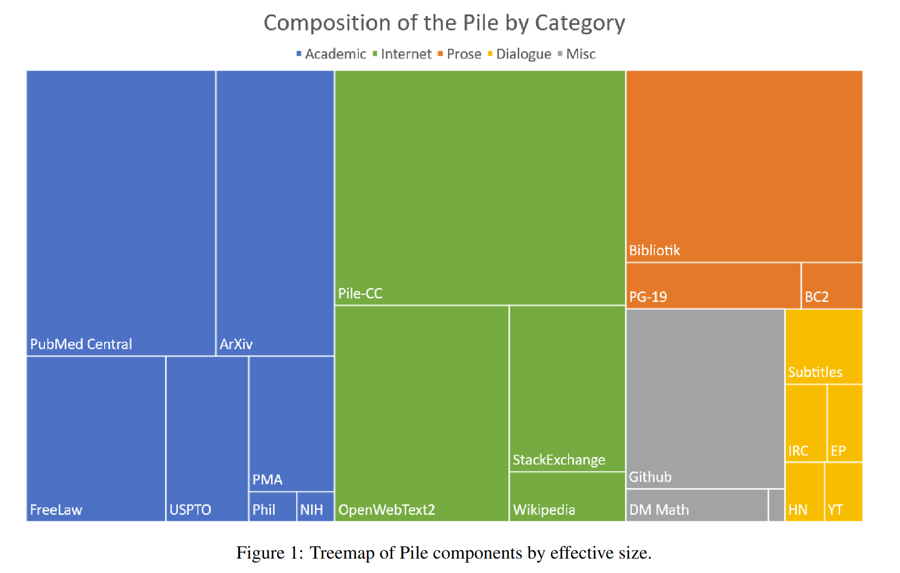
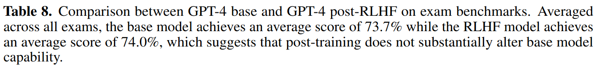

# Chat Bot
Trying to make a chatbot that has a better personality than me. 

In the meantime talk to john:  
`python john.py --size medium --device cpu --persona advisor`  
to get options do  
`python john.py --help`

TODO:
- [ ] Optimized pre prompting
	- Is it possible to tune the pre prompts in a way that produces the desired output.
- [ ] Connecting to the internet
	- [ ] Identify query and get wikipedia summary inside the pre prompt
	- [ ] Give web search results in prompt. The chatbot should also cite the sources.
- [ ] Making it much faster
	- [ ] Flash attention?
	- [ ] Pruning?
	- [ ] Quantization
- [ ] Voice input (use whisper)
    

#### Notes:
The pile data set's composition:

When running the model without user input you can notice what data 
the model is trained on. I have seen it output latex and c code.
The training data's composition should give insight into what prompting is 
required to "simulate" the desired response. For example when given a
stack exchange structure type prompt, it may be better at math.

**Pre prompting is all you need?**
